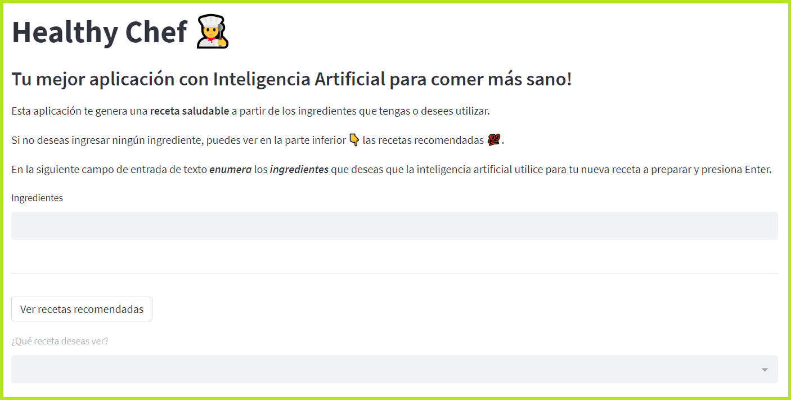

# HealthyChef App 👨‍🍳

**HealthyChef App** es una aplicación que utiliza inteligencia artificial para generar recetas saludables a partir de los ingredientes que tengas o desees utilizar.

## Funcionalidades

- Genera recetas saludables a partir de una lista de ingredientes.
- Muestra recetas recomendadas si no se ingresan ingredientes.
- Interfaz amigable y fácil de usar.

## Capturas de Pantalla

## Uso

1. Ingresa una lista de ingredientes en el campo de texto.
2. Presiona Enter para generar una receta basada en esos ingredientes.
3. Si no deseas ingresar ingredientes, puedes ver recetas recomendadas en la lista desplegable.

## Tecnologías Utilizadas

- [Streamlit](https://streamlit.io/) - Framework para la creación de aplicaciones web interactivas con Python.
- [OpenAI GPT-3](https://beta.openai.com/) - Motor de lenguaje natural para generación de texto.

